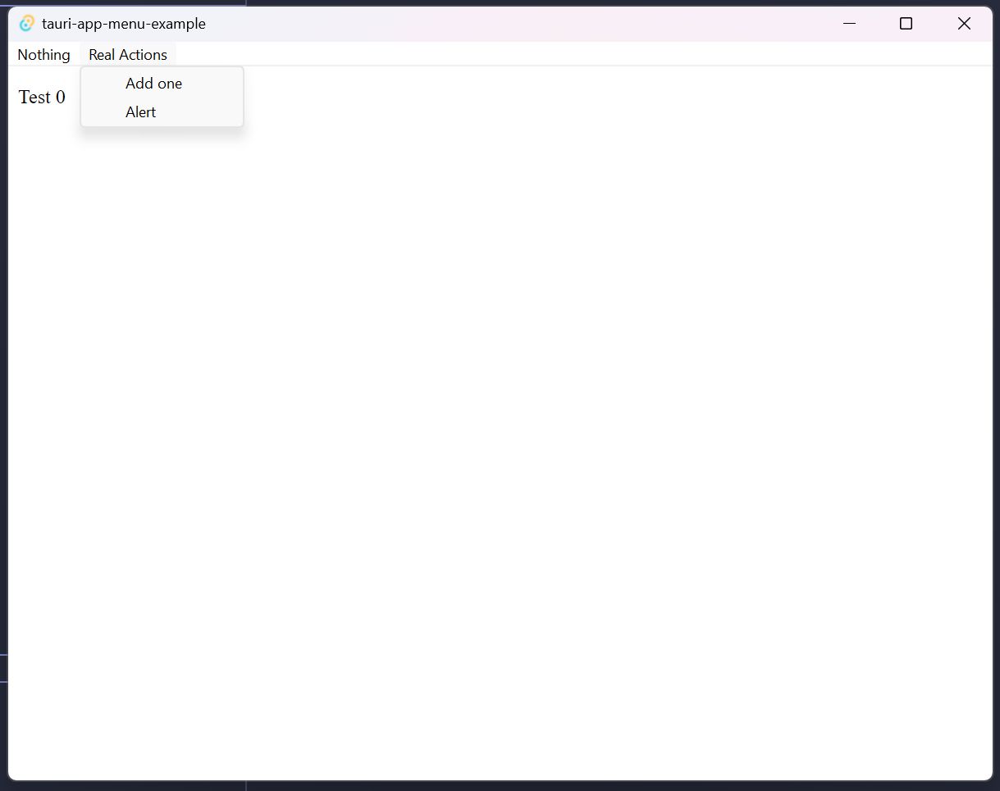

# Tauri 2.0 JS Menu API

This is a simple example of how to use the Tauri 2.0 JS Menu API.



## Pre-req

- Node.js 18
- PNPM 8
- Rust 1.7 & Cargo Installation

## Usage

After cloning and `cd`ing into the repo:

```shell
pnpm i
pnpm tauri:dev
```

## Setup steps

1) Add the permissions to `src-tauri/capabilities/default.json`

```json
{
  "#": "...",
  "permissions": [
    "menu:allow-new",
    "menu:allow-append",
    "menu:allow-prepend",
    "menu:allow-insert",
    "menu:allow-remove",
    "menu:allow-remove-at",
    "menu:allow-items",
    "menu:allow-get",
    "menu:allow-popup",
    "menu:allow-create-default",
    "menu:allow-set-as-app-menu",
    "menu:allow-set-as-window-menu",
    "menu:allow-text",
    "menu:allow-set-text",
    "menu:allow-is-enabled",
    "menu:allow-set-enabled",
    "menu:allow-set-accelerator",
    "menu:allow-set-as-windows-menu-for-nsapp",
    "menu:allow-set-as-help-menu-for-nsapp",
    "menu:allow-is-checked",
    "menu:allow-set-checked",
    "menu:allow-set-icon"
  ]
}

```

2) Import the APIs from `@tauri-apps/api/menu`

```typescript
import {Menu, Submenu} from '@tauri-apps/api/menu'

const macOS = navigator.userAgent.includes('Macintosh')

async function create() {
  const submenu = await Submenu.new({
    text: 'Nothing',
    items: [
      {
        text: 'Do nothing',
        enabled: false
      }
    ]
  })

  const menu = await Menu.new({
    items: [submenu]
  })
  await (macOS ? menu.setAsAppMenu() : menu.setAsWindowMenu())
}
```

3) Call the `create` function in your `main` function

```typescript
create();
```

4) ... ?

5) Profit!
